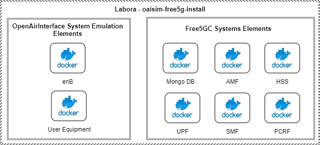
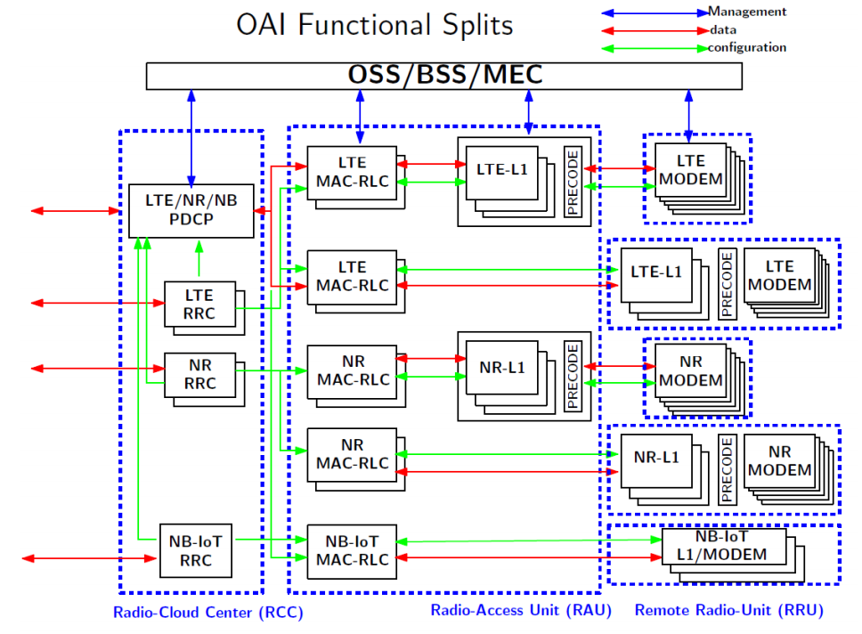
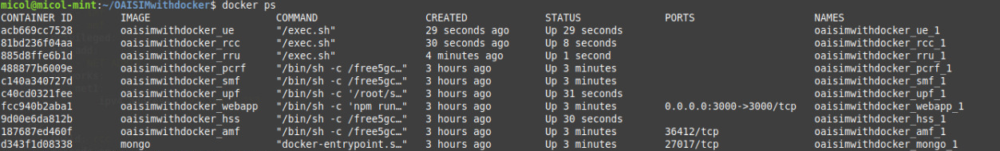
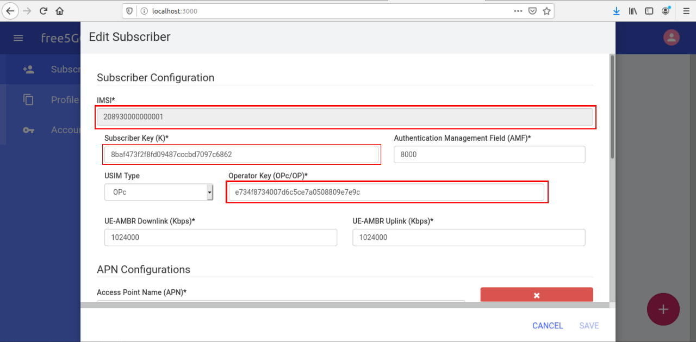
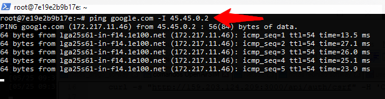
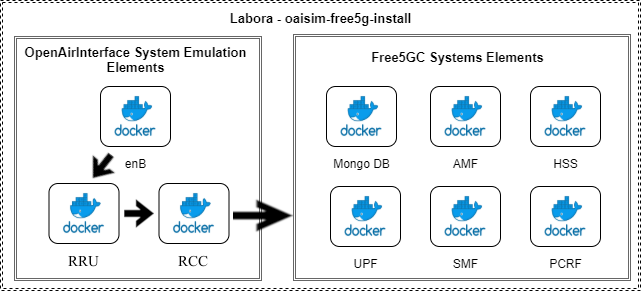

## OAISIM + free5GC with Docker.

This project is a simulation of the 5G environment of telecommunications networks. The objective of this work is to create a modular and containerized system for tests, simulations and analysis of the 5G communication network.

Therefore, this project makes use of two other major projects, Free5GCore and OpenAirInterface. In our project, the two environments communicate to generate the simulation. Everything was developed on top of the docker container platform and is orchestrated via docker compose

For more information about F5GC or OAI:
* [free5gc](https://www.free5gc.org/)
* [Open Air Interface](https://www.openairinterface.org/)

### Overview of the system structure

The image above represent the actual system and how it is placed.

<p align="center">
     
</p>

## Project Description

In this repository, we developed an environment for simulating UE and ENB using l2NFAPI simulator from Open Air interface connected into 5g core from free5gcore. This work is on-going.

The 5G have a lot of information and metricts that are fundamental to understand the sysmtem. With that in mind, lets focous especific on the part of the system that we are adressing our problem. This repository is focousing on the eNB of OpenAirInterface.

The eNB is the hardware that is connected to the mobile phone network that communicates directly wirelessly with mobile handsets (UEs). In this case, this hardware is simulated.

The main contribution of this branch is a split on eNB. Today the eNB can be classified in three main components, that can be visualized in this figure:

<p align="center">
     
</p>

However, this system was made to be a monolith environment, so every structure from above run in the same computer and in the same container. This functional split is made to alleviate the overload on the main eNB computer, by grouping the RCC and RAU in one container ans spliting the RRU to another. RRU also is a light part of the system that can be redundant.

At the moment, what we have is a splited eNB to run on one computer, with all the others components.
I have not tested yet if this program is running as expected in multiples machines.

## Minimum Requirement
- Software
    - OS: Ubuntu 18.04
    - Linux kernel: 4.15.0-43-generic

- Hardware recommended
    - CPU: Intel i5
    - RAM: 8GB
    - Hard drive: 50G

## Dependencies

To execute this program you need to install:

* [Docker](https://docs.docker.com/install/)
* [Docker Compose](https://docs.docker.com/compose/install/)

## Install

Each box of project is based on a compiled free5gc image. To build this image use the follow command:

``sudo docker build -t free5gc-base .``

Each box of project is based on a compiled oaisim image. To build this image use the follow command:

``cd oaisim-base``

``sudo docker build -t oaisim-base  .``

## Running

To run all boxes and Web interface use the follow command:

``sudo docker-compose up -d``

After the docker-compose, type ``sudo docker ps``. This is the expected result:
<p align="center">
    
</p>

## Testing

To verify if everthing is running okay, you can firt check if **MongoDB** and **Web User Interface** is initialized. You can check this in your browser with the address ```http://<deployment-environment-IP-address>:3000```

The Web Application access port can be changed through the parameter ```web_application_access_port```, the default value is _3000_. The default access credentials of the Web Application are:

* User: **admin**
* Pass: **1423**

After login, you must add one UE to the web interface for the tunneling on the user equipment work properly. By defaul this code is only using one user equipement for thesting the conectivity. You can add the information bellow to the respective windows.

``IMSI: 208930000000001``

``Subscriber Key: 8baf473f2f8fd09487cccbd7097c6862``

``Operator Key: e734f8734007d6c5ce7a0508809e7e9c``

<p align="center">
     
</p>

Then you can proced to the ue testing. Login on the container of the UE using the following command:

`` sudo docker exec -ti oaisimwithdocker_ue bash ``

Then use ``ifconfig`` to visualize the network configuration. The expected behavior can be seen in the figure bellow. 

<p align="center">
     
</p>

Now type ``` ping google.com -I 45.45.0.2 ```, we are using the comunication interface created on the web app to verify the conectivity of the UE, in this case the OAITUN_UE1 (OpenAirInterface Tunnel UE1) is located on 45.45.0.2, so the test is: ``` ping google.com -I 45.45.0.2 ```. The result should be equivalent to that shown in the next figure:

<p align="center">
     
</p>

The presented results demonstrate that the UE establish an internet connection. This connection is provided through combining functionality from all Docker containers, of Free5GC components and OpenAirInterface System Emulation components. The final reasult of this implementation can be seen bellow:

<p align="center">
     
</p>

## OAI Configuration

### Build

There are different ways of building OAI software when refferig to how to have the logical splits.
The ones that are currently more explored by our colleagues are:

1. RCC + RAU + RRU: without split
2. RCC + RAU <=> RRU: one functioal split

First build the base image:

```sh
docker build -t crosshaul:latest ./oaisim-base/
```

For both set ups, it is recommended to use the linux kernel in the low latency mode. So, make sure that the host
has the required packages installed by running the following command:

```sh
sudo apt-get install linux-image-lowlatency linux-headers-lowlatency
```

The OAI build have two steps, the first one, is about installing all required dependencies that the build requires.
The second one, is the build itself.

To install the dependencies the `-I` flag needs to be provided to the `build_oai` command. Let's take the following command
as an example:

```sh
source oaienv; ./cmake_targets/build_oai -I --eNB --install-system-files -w USRP;
```

- `-I`: declares that the command should install the dependencies
- `--eNB`: declares that eNB dependencies shall be installed
- `--install-system-files` declares that system files dependencies shall be installed
- `-w USRP`: declares that *USRP* shall be considered for the build, then, its dependencies will also be installed

#### RCC + RAU + RRU

To define that we want to build one eNB with all the network layers (without split) we need to set the
`node_function` configuration to `3GPP_eNODEB`. This allows to run all the stack in a single container.

```sh
source oaienv; ./cmake_targets/build_oai -w USRP --eNB;
```

#### RCC + RAU <=> RRU

To have the stack split between RRU and RCC (two containers) the `node_function` config needs to be set to
`NGFI_RCC_IF4p5`.

Then the RCC and RRU can be built:

RCC build:

```sh
source oaienv; ./cmake_targets/build_oai --eNB;
```

RRU build:

```sh
source oaienv; ./cmake_targets/build_oai -w USRP --eNB;
```

In this scenario, we only need to build the USRP dependencies in the RRU build as the RCC will not
be connected with the USRP equipment. But, it would cause no arm to build the USRP in the RCC as well,
it is just not necessary.

https://github.com/lasseufpa/connected-ai-testbed/blob/master/scenarios/drone/create-scenario.sh
